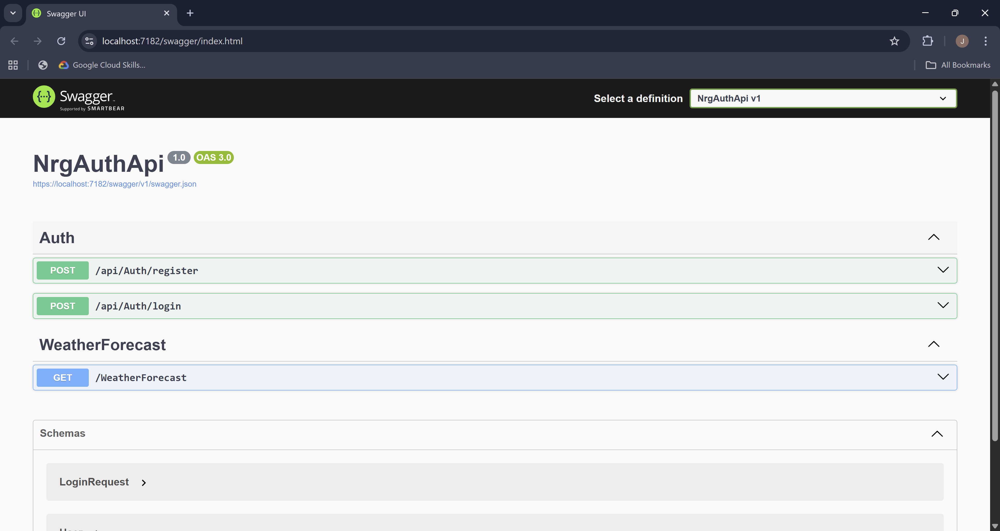

# NRG Foods Authentication Application

A full-stack authentication application built with Angular frontend and .NET backend.

## Tech Stack

### Frontend
- **Angular 17**
- **TypeScript**
- **Bootstrap 5**
- **HTML5 / CSS3**
- **RxJS & Angular Forms**
- **HTTP Client Module** (for API communication)

### Backend
- **.NET 9 Web API**
- **C#**
- **Entity Framework Core 9**
- **SQL Server**
- **JWT Authentication (optional)**
- **ASP.NET Identity (optional)**
- **CORS Enabled** (for Angular frontend communication)
- **DbContext** for database operations
- **Models & Controllers** for handling API endpoints

## Project Structure

### Frontend
- `src/app/register/` – User registration component
- `src/app/login/` – Login component
- `src/app/dashboard/` – Dashboard component
- `src/app/app-routing.module.ts` – Frontend routing configuration
- `src/styles.css` – Global styles (Bootstrap included)

### Backend
- `NrgAuthApi/Controllers/` – API controllers
- `NrgAuthApi/Models/` – Entity models
- `NrgAuthApi/Data/` – DbContext for database operations
- `Program.cs` – API configuration and CORS setup
- `appsettings.json` – Connection strings and settings

## Screenshots

### Login Page

### Register Page

### Dashboard

### Users List in SSMS DB

### Swagger API Documentation

